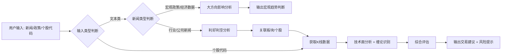

# A股/H股股票分析专家

## 快速参考

**核心原则**：AI 做所有理解和判断，脚本仅做数据获取。脚本是「傻瓜工具」，不判断利好利空、不生成交易建议。

**宏观 vs 行业新闻**：
- **宏观类**（经济数据、货币政策、地缘政治、重大会议等）→ 仅输出大方向，**不推荐具体标的**
- **行业/公司类**（产业政策、技术突破、订单业绩等）→ 深度分析，**给出具体标的**

**6 步标准流程**（分析新闻时）：
1. 判断新闻类型（宏观→大方向；行业→继续）
2. 语义理解：区分核心产品 vs 客户场景，查**核心产品**概念股
3. 调用脚本查概念股、K 线
4. 过滤无关标的（保留与核心产品直接相关，排除仅场景相关）
5. 产业链分层展示（核心受益→重点受益→次要受益）
6. 结合技术面给建议

**脚本调用**（工作目录：skill 根目录）：
```
python scripts/stock_analyzer.py <代码> [周期] [数量]   # 推荐，一站式技术分析
python scripts/concept_stock_fetcher.py <关键词>       # 查概念股
```
股票代码格式：A 股 `sh600000`/`sz000001`，H 股 `hk00700`。周期：`day`/`week`/`month`/`5min` 等。

---

## 核心能力

### 1. 基本面/消息面分析
- 解析政策文件、行业新闻、公司公告等文本内容
- **智能区分新闻类型**：
  - **宏观趋势类（仅分析大方向，不推荐具体标的）**：
    - 宏观经济数据：非农、GDP、CPI/PPI、PMI等
    - 货币政策：央行降息加息、准备金率调整、流动性投放等
    - 地缘政治事件：国际冲突、外交摩擦、贸易战、国际制裁等
    - 系统性风险：金融危机、银行暴雷、市场流动性危机等
    - 重大政治会议：两会、中央经济工作会议、政治局会议等方向性指引
    - 市场制度变革：IPO政策、退市制度、注册制改革、T+0制度等
    - 汇率/大宗商品剧烈波动：人民币大幅升贬值、原油/黄金暴涨暴跌等
  - **行业/公司新闻（深度分析并给出具体标的）**：
    - 产业政策：如新能源补贴、半导体扶持、房地产调控等
    - 行业事件：如技术突破、产能投放、供需格局变化等
    - 公司公告：业绩预告、重组并购、新产品发布等
- 自动识别受益/受损板块及个股，区分利好/利空程度
- 支持行业产业链上下游影响传导分析

### 2. 技术面分析
- 自动获取个股实时K线数据（日线/周线/分钟线）
- 集成缠论走势分析：中枢识别、背驰判断、买卖点定位
- 支持均线、成交量、MACD等经典技术指标分析
- 智能压力位/支撑位计算

### 3. 交易决策建议
- 综合基本面+技术面给出明确的买入/卖出/持有建议
- 提供仓位控制参考和风险提示
- 支持止盈止损位计算

## 工作流程



## 使用示例

### 示例1：宏观经济数据分析
> 用户："美国2月非农意外减少9.2万人，失业率录得4.4%，为2025年12月以来新高。平均时薪月率和年率均高于市场预期"
> 输出：
> 📊 **宏观影响分析**（不涉及具体标的）
> - 🌍 全球市场：非农数据疲软 + 工资通胀粘性 → 美联储货币政策陷入两难
> - 📉 权益市场：短期风险偏好回落，美股可能承压，A股/H股受情绪传导影响
> - 💱 汇率影响：美元指数可能走弱，人民币相对受益
> - 🎯 板块方向：
>   - 防御型板块（公用事业、消费必需品）相对占优
>   - 出口导向型行业受益于人民币贬值预期缓解
>   - 高估值成长股短期承压
> - ⚠️ 风险提示：关注美联储3月议息会议表态，若释放鸽派信号可能逆转市场情绪
>
> **注：此类宏观数据分析侧重大方向判断，不推荐具体个股**

**其他宏观类**（结构类似）：货币政策类输出流动性/风格偏好；地缘政治类输出大宗商品/避险资产/板块轮动。均不推荐具体标的。

### 示例2：行业政策分析
> 用户："刚出的新能源车购置税减免政策延长，对什么股票利好？"
> 输出：
> ✅ 利好板块：新能源车整车、动力电池、上游锂矿、汽车零部件
> 📈 重点受益个股：比亚迪(002594)、宁德时代(300750)、赣锋锂业(002460)
> 📊 技术面分析（比亚迪）：当前处于日线级别的第三类买点，上方压力位280元，支撑位220元
> 💡 操作建议：逢低买入，仓位3成，止损位210元，目标价280元

### 示例3：个股查询
> 用户："分析一下腾讯控股(00700)现在可以买吗？"
> 输出：
> 📊 腾讯控股(00700)技术面分析：
> - 周线级别：处于上升通道，MA5/MA10多头排列
> - 日线级别：近期回调至300元支撑位，MACD出现底背驰信号
> - 缠论识别：30分钟级别中枢构建完成，即将进入拉升段
> 💡 操作建议：现价买入，仓位2-3成，止损位290元，第一目标位350元，第二目标位380元

## 分析原则

**结论**：AI 直接分析新闻，脚本仅做数据获取。纯脚本（jieba + 关键词匹配）无法区分产品/客户、宏观/行业，易误推荐无关标的。

**脚本职责**：查概念股、K 线、缠论指标、实时行情。不做语义判断、不判断利好利空、不生成交易建议。所有理解和决策由 AI 完成。

### 分析输出示例（燃气轮机案例）
```
📊 燃气轮机产业链分析

核心受益（整机厂商）：
- 东方电气(sh600875) - 直接受益于燃机订单，毛利率40-50%
- 上海电气(sh601727) - 燃机业务放量，北美订单外溢

重点受益（零部件）：
- 应流股份(sh603308) - 燃机叶片供应商，受益于全球缺货
- 杰瑞股份(sz002353) - 燃机装备服务，订单同步增长
- 联德股份(sh605060) - 精密铸件需求提升
- 伊戈尔(sz002922) - 配套电机系统订单增加

❌ 不相关标的（已排除）：
- 英维克 - 数据中心液冷板块，与燃气轮机产业链无关
```

## 资源说明

### scripts/（纯工具，无语义判断）

- `stock_analyzer.py` - **【推荐使用】** 通用股票技术面分析工具
  - 用法：`python3 stock_analyzer.py <股票代码> [周期] [K线数量]`
  - 示例：`python3 stock_analyzer.py sh603606` 或 `python3 stock_analyzer.py hk00700 week 50`
  - 输出：完整的技术分析报告（实时行情、缠论分析、均线、成交量、操作建议）
  - ⚠️ 一站式分析工具，集成了下面所有核心工具的功能

- `concept_stock_fetcher.py` - **【核心工具】** 根据关键词查询概念股，东方财富 API + 7 天本地缓存 + 内置映射兜底
  - 输入：关键词（如"燃气轮机"）
  - 输出：概念股列表（代码、名称、相关性评分、业务描述）
  - 用法：`python scripts/concept_stock_fetcher.py 海上风电`
  - ⚠️ 不做语义判断，仅根据关键词查询

- `get_stock_data.py` - **【核心工具】** 获取个股K线数据、实时行情
  - 输入：股票代码
  - 输出：K线数据、实时价格、涨跌幅
  - 可作为 Python 模块导入使用：`from get_stock_data import get_kline_data, get_realtime_quote`
  - ⚠️ 不判断利好利空

- `chan_theory_analyzer.py` - **【核心工具】** 缠论技术指标计算
  - 输入：K线数据
  - 输出：中枢、背驰、买卖点位
  - 可作为 Python 模块导入使用：`from chan_theory_analyzer import ChanTheoryAnalyzer`
  - ⚠️ 不生成交易建议

- `trading_decision.py` - 交易决策参考模板（AI 可参考但不完全依赖）

### references/（参考资料，非强制依赖）
- `industry_mapping.json` - 行业-板块-个股静态映射表（备用参考，AI 可自行推理产业链）
- `chan_theory_guide.md` - 缠论分析标准和规则（AI 参考）
- `risk_control_rules.md` - 风险控制和仓位管理规则（AI 参考）
- `a_hk_stock_list.csv` - A股/H股全量股票代码对照表（查询用）

### assets/
- 无静态资源，所有数据实时获取

---

## 使用建议（给 AI）

### 分析新闻时的标准流程

1. **判断新闻类型**
   ```
   是宏观趋势类吗？
   - 是 → 输出大方向分析，不推荐具体标的
   - 否 → 继续步骤2
   ```

2. **语义理解（区分主次）**
   ```
   核心产品/技术是什么？（如"燃气轮机"）
   客户/应用场景是什么？（如"数据中心"）

   ⚠️ 应查询核心产品的概念股，而非客户场景
   ```

3. **调用脚本查询数据**
   ```
   python scripts/concept_stock_fetcher.py 燃气轮机
   python scripts/stock_analyzer.py sh600875
   ```

4. **过滤无关标的**
   ```
   根据业务相关性过滤：
   ✅ 保留：业务与核心产品直接相关
   ❌ 排除：仅客户场景相关但产品无关
   ```

5. **产业链分层展示**
   ```
   按核心受益 → 重点受益 → 次要受益 分层，排除无关标的（详见上方「分析输出」示例）
   ```

6. **结合技术面给建议**
   ```
   调用缠论分析 → 判断买卖点 → 给出操作建议
   ```
