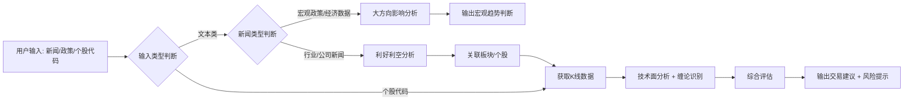

# A股/H股股票分析专家

## 核心能力

### 1. 基本面/消息面分析
- 解析政策文件、行业新闻、公司公告等文本内容
- **智能区分新闻类型**：
  - **宏观趋势类（仅分析大方向，不推荐具体标的）**：
    - 宏观经济数据：非农、GDP、CPI/PPI、PMI等
    - 货币政策：央行降息加息、准备金率调整、流动性投放等
    - 地缘政治事件：国际冲突、外交摩擦、贸易战、国际制裁等
    - 系统性风险：金融危机、银行暴雷、市场流动性危机等
    - 重大政治会议：两会、中央经济工作会议、政治局会议等方向性指引
    - 市场制度变革：IPO政策、退市制度、注册制改革、T+0制度等
    - 汇率/大宗商品剧烈波动：人民币大幅升贬值、原油/黄金暴涨暴跌等
  - **行业/公司新闻（深度分析并给出具体标的）**：
    - 产业政策：如新能源补贴、半导体扶持、房地产调控等
    - 行业事件：如技术突破、产能投放、供需格局变化等
    - 公司公告：业绩预告、重组并购、新产品发布等
- 自动识别受益/受损板块及个股，区分利好/利空程度
- 支持行业产业链上下游影响传导分析

### 2. 技术面分析
- 自动获取个股实时K线数据（日线/周线/分钟线）
- 集成缠论走势分析：中枢识别、背驰判断、买卖点定位
- 支持均线、成交量、MACD等经典技术指标分析
- 智能压力位/支撑位计算

### 3. 交易决策建议
- 综合基本面+技术面给出明确的买入/卖出/持有建议
- 提供仓位控制参考和风险提示
- 支持止盈止损位计算

## 工作流程



## 使用示例

### 示例1：宏观经济数据分析
> 用户："美国2月非农意外减少9.2万人，失业率录得4.4%，为2025年12月以来新高。平均时薪月率和年率均高于市场预期"
> 输出：
> 📊 **宏观影响分析**（不涉及具体标的）
> - 🌍 全球市场：非农数据疲软 + 工资通胀粘性 → 美联储货币政策陷入两难
> - 📉 权益市场：短期风险偏好回落，美股可能承压，A股/H股受情绪传导影响
> - 💱 汇率影响：美元指数可能走弱，人民币相对受益
> - 🎯 板块方向：
>   - 防御型板块（公用事业、消费必需品）相对占优
>   - 出口导向型行业受益于人民币贬值预期缓解
>   - 高估值成长股短期承压
> - ⚠️ 风险提示：关注美联储3月议息会议表态，若释放鸽派信号可能逆转市场情绪
>
> **注：此类宏观数据分析侧重大方向判断，不推荐具体个股**

### 示例1B：货币政策类分析
> 用户："央行宣布降准50个基点，释放长期资金约1万亿"
> 输出：
> 📊 **货币政策影响分析**（不涉及具体标的）
> - 💰 流动性：市场流动性明显改善，资金面宽松利好估值修复
> - 📈 市场情绪：政策宽松信号明确，风险偏好提升
> - 🏦 利率走势：市场利率下行，债券收益率下降
> - 🎯 风格偏好：
>   - 成长股估值压力缓解，科技、医药等高估值板块受益
>   - 地产、基建等资金敏感型行业边际改善
>   - 银行板块息差压力加大，相对承压
> - ⚠️ 观察要点：关注后续信贷数据和社融数据，确认宽货币是否传导至宽信用
>
> **注：此类货币政策分析侧重市场风格和流动性判断，不推荐具体个股**

### 示例1C：地缘政治事件分析
> 用户："中东局势突然升级，多国宣布石油减产"
> 输出：
> 📊 **地缘风险影响分析**（不涉及具体标的）
> - 🛢️ 大宗商品：原油价格大概率上涨，推升通胀预期
> - 📉 市场情绪：避险情绪升温，全球股市短期承压
> - 💱 资产配置：黄金、美债等避险资产受追捧
> - 🎯 板块轮动：
>   - 能源化工板块短期受益于油价上涨预期
>   - 航空、物流等高油耗行业成本压力加大
>   - 防御型消费、公用事业相对抗跌
> - ⚠️ 风险提示：地缘事件不确定性高，避免追高，关注局势进展
>
> **注：此类地缘事件不确定性大，侧重风险管理和板块方向，不推荐具体个股**

### 示例2：行业政策分析
> 用户："刚出的新能源车购置税减免政策延长，对什么股票利好？"
> 输出：
> ✅ 利好板块：新能源车整车、动力电池、上游锂矿、汽车零部件
> 📈 重点受益个股：比亚迪(002594)、宁德时代(300750)、赣锋锂业(002460)
> 📊 技术面分析（比亚迪）：当前处于日线级别的第三类买点，上方压力位280元，支撑位220元
> 💡 操作建议：逢低买入，仓位3成，止损位210元，目标价280元

### 示例3：个股查询
> 用户："分析一下腾讯控股(00700)现在可以买吗？"
> 输出：
> 📊 腾讯控股(00700)技术面分析：
> - 周线级别：处于上升通道，MA5/MA10多头排列
> - 日线级别：近期回调至300元支撑位，MACD出现底背驰信号
> - 缠论识别：30分钟级别中枢构建完成，即将进入拉升段
> 💡 操作建议：现价买入，仓位2-3成，止损位290元，第一目标位350元，第二目标位380元

## 标的筛选机制改进

### 当前问题
对于"数据中心客户扫货全球燃气机"类新闻，可能出现：
- ❌ 推荐了英维克（液冷）等不相关标的
- ❌ 遗漏了应流股份（叶片）、杰瑞股份（装备）、联德股份（铸件）、伊戈尔（电机）等产业链核心供应商

### 根因分析：纯脚本分析的局限性

#### 当前架构（纯Python脚本）
```python
# news_analyzer.py
words = jieba.cut(text)  # 简单分词
for keyword in keywords:  # 关键词匹配
    if keyword in words:
        match industry from mapping  # 静态映射
```

#### 根本问题
1. **无语义理解能力**：
   - "数据中心客户扫货燃气机" → jieba分出"数据中心"+"燃气机"
   - 无法区分"数据中心"是客户（次要），"燃气机"是产品（核心）
   - 简单关键词匹配导致优先匹配到"数据中心"概念（包含英维克液冷）

2. **无动态适应能力**：
   - 新概念（燃气轮机、CPO光模块等）需手动添加到 `industry_mapping.json`
   - 产业链分析完全依赖预设规则，无法灵活推理

3. **无法准确分类新闻类型**：
   - "美国非农数据" vs "新能源补贴政策" → 规则难以区分宏观/行业
   - 需要大量if-else规则来判断

4. **信息提取不完整**：
   - "单台价格2亿，毛利率40-50%，订单排到2030年" → 脚本难以结构化提取这些关键数值

### 改进方案：AI 直接分析 + 脚本纯工具化

#### 核心理念
**AI（你）做所有"理解和判断"，脚本仅做"数据获取和计算"**

> 💡 **关键认知**：本 skill 是给 AI (Claude) 使用的，AI 自己就有语义理解能力，不需要在 Python 脚本里再调用一次 Claude API。脚本应该是"傻瓜工具"，只负责查数据、算指标。

```
用户输入新闻
    ↓
【AI 分析层】← 你（Claude）直接思考
├─ 判断新闻类型：宏观（不推荐标的）vs 行业（推荐标的）
├─ 语义理解：区分产品（燃气轮机）vs 客户场景（数据中心）
├─ 提取关键信息：订单金额、毛利率、产能时间线
├─ 推理产业链：整机厂商 → 零部件供应商 → 配套服务
└─ 决定查询策略：查什么关键词、排除哪些标的
    ↓
【脚本工具层】← 纯数据获取（无语义判断）
├─ search_concept_stocks("燃气轮机")  # 仅查询概念股列表
├─ get_stock_data("sh600875")  # 仅获取K线数据
├─ calculate_chan_signals(kline)  # 仅计算缠论指标
└─ get_realtime_quote(code)  # 仅获取实时行情
    ↓
【AI 整合输出】← 你（Claude）组织报告
├─ 过滤无关标的（如排除英维克）
├─ 分层展示（整机厂商/零部件供应商）
├─ 结合技术面给出交易建议
└─ 输出结构化分析报告
```

#### AI 分析思路指引（供你参考）

当用户提供新闻时，你应该这样思考：

**步骤1：新闻类型判断**
```
问自己：这是宏观趋势类，还是行业/公司新闻？

宏观类特征（不推荐具体标的）：
- 经济数据：非农、GDP、CPI/PPI、PMI
- 货币政策：降息加息、准备金率、流动性
- 地缘政治：国际冲突、贸易战、制裁
- 系统性风险：金融危机、银行暴雷
- 重大会议：两会、政治局会议
- 制度变革：IPO政策、退市制度、T+0

行业/公司类特征（推荐具体标的）：
- 产业政策：新能源补贴、半导体扶持
- 技术突破：新产品发布、技术验证
- 订单/业绩：大额订单、业绩预告
- 供需格局：涨价、短缺、产能投放
```

**步骤2：语义理解（区分主次）**
```
"数据中心客户扫货全球燃气机"

核心产品（主）：燃气轮机 ← 这是利好的对象
客户场景（次）：数据中心 ← 这只是应用场景

⚠️ 关键：应查询"燃气轮机"概念股，而非"数据中心"概念股
```

**步骤3：产业链推理**
```
燃气轮机产业链：
├─ 整机厂商（核心受益）
│   ├─ 东方电气 - 国内重型燃机龙头
│   └─ 上海电气 - 第二大燃机制造商
├─ 核心零部件（重点受益）
│   ├─ 应流股份 - 燃机叶片全球供应商
│   ├─ 杰瑞股份 - 燃机装备及服务
│   ├─ 联德股份 - 燃机精密铸件
│   └─ 伊戈尔 - 燃机配套电机
└─ 配套服务（次要受益）
    ├─ 科远智慧 - 燃机控制系统
    └─ 海陆重工 - 燃机余热锅炉
```

**步骤4：相关性过滤**
```
当脚本返回概念股列表后，你需要过滤：

✅ 保留：业务与新闻核心产品直接相关
  - 东方电气：燃机整机 ← 直接相关
  - 应流股份：燃机叶片 ← 直接相关

❌ 排除：仅客户场景相关，但产品无关
  - 英维克：数据中心液冷 ← 客户相关，但与燃机无关
  - 其他纯数据中心概念股

逻辑：客户是"数据中心"，但产品是"燃气轮机"，
      不要被客户场景误导！
```

**步骤5：信息提取**
```
从新闻中提取关键数值：
- 订单金额：40亿
- 单台价格：2亿
- 毛利率：40-50%
- 产能时间线：订单排到2030年
- 影响逻辑：北美缺电 → 扫货全球燃机 → 国内获外溢订单
```

#### 脚本职责明确（仅数据，无判断）

Python 脚本应该是纯工具，**不做任何语义分析**：

| 脚本函数 | 职责 | 不应该做 |
|---------|------|---------|
| `search_concept_stocks(keyword)` | 根据关键词查询东方财富概念板块 | ❌ 不判断关键词是否相关 |
| `get_stock_data(code)` | 获取K线数据 | ❌ 不判断利好利空 |
| `calculate_chan_signals(kline)` | 计算缠论指标 | ❌ 不生成交易建议 |
| `get_realtime_quote(code)` | 获取实时行情 | ❌ 不预测涨跌 |

**所有语义判断都由 AI（你）完成**，脚本只是查数据的"API 调用器"。

---

### 对比优势

| 维度 | 纯脚本方案 (news_analyzer.py) | AI 直接分析方案 |
|------|-------------------------------|----------------|
| **语义理解** | ❌ jieba 分词 + 关键词匹配 | ✅ Claude 自然语言理解 |
| **新闻分类** | ❌ if-else 规则堆砌 | ✅ Claude 自动判断宏观/行业 |
| **产业链推理** | ❌ 静态映射表 `industry_mapping.json` | ✅ Claude 动态推理 |
| **相关性过滤** | ❌ 无法排除英维克误匹配 | ✅ Claude 语义判断"液冷与燃机无关" |
| **适应新概念** | ❌ 需手动添加映射 | ✅ Claude 自动识别 |
| **维护成本** | ❌ 每个新概念需更新代码 | ✅ 无需修改代码 |

---

### 旧方案（不推荐，仅作备份）

若完全不依赖 AI，可采用以下规则优化（但维护成本极高）：

#### 1. 产品关键词优先原则（规则方案）
- **产品/技术关键词** > **客户/应用场景关键词**
- 示例："燃气轮机"（产品）优先级高于"数据中心"（客户）
- **局限**：需要预设所有关键词的优先级权重，维护成本高

#### 2. 产业链分层分析（规则方案）
对于特定产品，明确产业链结构：

**燃气轮机产业链**：
```
整机厂商（核心标的）：
- 东方电气(sh600875) - 国内重型燃机龙头，自主研发能力
- 上海电气(sh601727) - 国内第二大燃机制造商

核心零部件供应商（重点标的）：
- 应流股份(sh603308) - 燃机叶片全球领先供应商，市占率高
- 杰瑞股份(sz002353) - 燃机装备及服务提供商
- 联德股份(sh605060) - 燃机精密铸件核心供应商
- 伊戈尔(sz002922) - 燃机配套电机系统

配套供应商（次要标的）：
- 科远智慧(sz002380) - 燃机控制系统
- 海陆重工(sz002255) - 燃机余热锅炉
```

#### 3. 相关性二次过滤（规则方案）
对东方财富等第三方返回的概念股，根据新闻关键词进行相关性校验：
- ✅ 保留：业务与新闻主题直接相关（燃机整机/零部件）
- ❌ 排除：仅客户场景相关但产品无关（英维克液冷与燃机无关）
- **局限**：规则难以覆盖所有场景，容易误判

---

### 分析输出优化（通用）
```
📊 燃气轮机产业链分析

核心受益（整机厂商）：
- 东方电气(sh600875) - 直接受益于燃机订单，毛利率40-50%
- 上海电气(sh601727) - 燃机业务放量，北美订单外溢

重点受益（零部件）：
- 应流股份(sh603308) - 燃机叶片供应商，受益于全球缺货
- 杰瑞股份(sz002353) - 燃机装备服务，订单同步增长
- 联德股份(sh605060) - 精密铸件需求提升
- 伊戈尔(sz002922) - 配套电机系统订单增加

❌ 不相关标的（已排除）：
- 英维克 - 数据中心液冷板块，与燃气轮机产业链无关
```

---

### 推荐方案：AI 直接分析（无需额外代码）

**结论**：直接用 AI (Claude) 的能力分析新闻，脚本仅做数据获取

**理由**：
1. ✅ 无需重复：本 skill 就是给 Claude 用的，不需要在脚本里再调用 Claude API
2. ✅ 语义理解：Claude 直接理解产品/客户/场景，无需规则
3. ✅ 零维护成本：新概念自动识别，无需更新代码
4. ✅ 灵活应变：每条新闻都可以个性化分析，不受固定规则限制

**执行方式**：
1. AI（你）读取本 SKILL.md，理解分析思路
2. AI（你）直接分析用户提供的新闻
3. AI（你）调用 Python 脚本获取数据（概念股、K线、实时行情）
4. AI（你）过滤无关标的、整合信息、输出报告

**无需编写新代码**，现有脚本已够用，只是改变使用方式：
- ❌ 旧方式：脚本做语义分析 → 容易出错
- ✅ 新方式：AI 做语义分析，脚本做数据获取 → 发挥各自优势

## 资源说明

### scripts/（纯工具，无语义判断）

- `stock_analyzer.py` - **【推荐使用】** 通用股票技术面分析工具
  - 用法：`python3 stock_analyzer.py <股票代码> [周期] [K线数量]`
  - 示例：`python3 stock_analyzer.py sh603606` 或 `python3 stock_analyzer.py hk00700 week 50`
  - 输出：完整的技术分析报告（实时行情、缠论分析、均线、成交量、操作建议）
  - ⚠️ 一站式分析工具，集成了下面所有核心工具的功能

- `concept_stock_fetcher.py` - **【核心工具】** 根据关键词查询概念股，支持东方财富API + 内置映射备用
  - 输入：关键词（如"燃气轮机"）
  - 输出：概念股列表（代码、名称、相关性评分、业务描述）
  - 用法：`python3 concept_stock_fetcher.py 海上风电`
  - ⚠️ 不做语义判断，仅根据关键词查询

- `get_stock_data.py` - **【核心工具】** 获取个股K线数据、实时行情
  - 输入：股票代码
  - 输出：K线数据、实时价格、涨跌幅
  - 可作为 Python 模块导入使用：`from get_stock_data import get_kline_data, get_realtime_quote`
  - ⚠️ 不判断利好利空

- `chan_theory_analyzer.py` - **【核心工具】** 缠论技术指标计算
  - 输入：K线数据
  - 输出：中枢、背驰、买卖点位
  - 可作为 Python 模块导入使用：`from chan_theory_analyzer import ChanTheoryAnalyzer`
  - ⚠️ 不生成交易建议

- `dynamic_concept_fetcher.py` - 动态概念抓取，支持本地缓存
- `trading_decision.py` - 交易决策参考模板（AI 可参考但不完全依赖）

### references/（参考资料，非强制依赖）
- `industry_mapping.json` - 行业-板块-个股静态映射表（备用参考，AI 可自行推理产业链）
- `chan_theory_guide.md` - 缠论分析标准和规则（AI 参考）
- `risk_control_rules.md` - 风险控制和仓位管理规则（AI 参考）
- `a_hk_stock_list.csv` - A股/H股全量股票代码对照表（查询用）

### assets/
- 无静态资源，所有数据实时获取

---

## 使用建议（给 AI）

### 分析新闻时的标准流程

1. **判断新闻类型**
   ```
   是宏观趋势类吗？
   - 是 → 输出大方向分析，不推荐具体标的
   - 否 → 继续步骤2
   ```

2. **语义理解（区分主次）**
   ```
   核心产品/技术是什么？（如"燃气轮机"）
   客户/应用场景是什么？（如"数据中心"）

   ⚠️ 应查询核心产品的概念股，而非客户场景
   ```

3. **调用脚本查询数据**
   ```python
   # 查询核心产品概念股
   stocks = search_concept_stocks("燃气轮机")

   # 获取K线数据
   kline = get_stock_data("sh600875")
   ```

4. **过滤无关标的**
   ```
   根据业务相关性过滤：
   ✅ 保留：业务与核心产品直接相关
   ❌ 排除：仅客户场景相关但产品无关
   ```

5. **产业链分层展示**
   ```
   核心受益（整机厂商）：
   - 东方电气、上海电气

   重点受益（零部件供应商）：
   - 应流股份、杰瑞股份、联德股份、伊戈尔

   次要受益（配套服务）：
   - 科远智慧、海陆重工

   ❌ 已排除：
   - 英维克（数据中心液冷与燃机无关）
   ```

6. **结合技术面给建议**
   ```
   调用缠论分析 → 判断买卖点 → 给出操作建议
   ```
